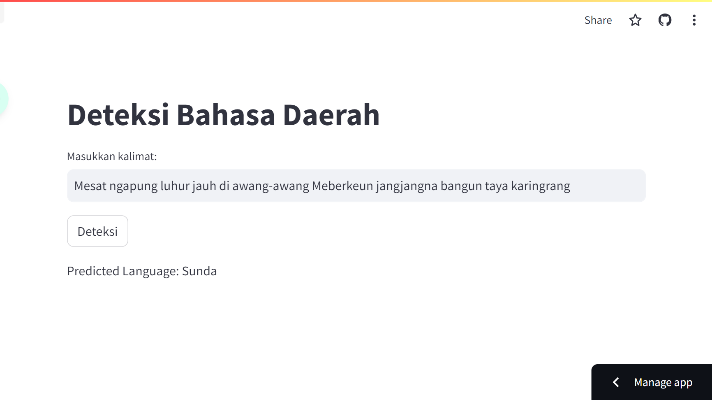

# Comparison of Naïve Bayes and Support Vector Machine Methods in Classifying 22 Regional Languages
Indonesia boasts a rich cultural diversity, encompassing over 1300 ethnic groups and 2500 regional languages. The challenge arises due to the multitude of regional languages in Indonesia, making language identification in textual form difficult. This research compares Machine Learning methods for classifying 22 regional languages in Indonesia, aiming to provide a deep understanding of the relative performance of each method. The study successfully addresses the primary difficulty, which is the identification of regional languages in Indonesia. The main constraint of this research lies in the complexity of regional languages in Indonesia, with various characteristics, variations in grammar, and differing sentence structures, resulting in accuracy not yet reaching perfection. This factor opens opportunities for future research through parameter optimization or exploration of alternative methods. Evaluation results indicate that the Support Vector Machine achieves the highest accuracy, reaching 89.41%, making it the preferred choice for model implementation. Although Nae Bayes yields good results with an accuracy of 82.08%, Support Vector Machine remains the preferred option. The application of the model using Streamlit demonstrates the effectiveness of the Support Vector Machine in accurately predicting Javanese song lyrics. This research has the potential to assist users in identifying regional languages based on text and contributes significantly to understanding Machine Learning methods for classifying regional language texts. Despite its limitations, this study can be extended to other regional languages, enhancing model accuracy through parameter improvements.

## 📁 Dataset Information
The data used is taken from [Korpus Nusantara](https://github.com/herrysujaini/korpusnusantara).

## 📷 Screenshot

## 🌐 Deployment
The prediction model is deployed using Streamlit, and you can interact with it [here](https://bahasadaerah.streamlit.app/).

## 🎌 Supported Regional Languages:
| No. | Language | No. | Language |
| 1. | Batak Toba | 12. | Madura |
| 2. | Bugis Kelolau | 13. | Melayu Kembayan |
| 3. | Bugis Wajo | 14. | Melayu Ketapang |
| 4. | Dayak Ahe | 15. | Melayu Melawi |
| 5. | Dayak Pesaguan | 16. | Melayu Pontianak |
| 6. | Dayak Taman | 17. | Melayu Putussibau |
| 7. | Jawa | 18. | Melayu Sambas |
| 8. | Jawa Kromo | 19. | Melayu Sintang |
| 9. | Jawa Ngoko | 20. | Padang |
| 10. | Kapuas Hulu | 21. | Sunda |
| 11. | Khek Pontianak | 22. | Tio Ciu Pontianak |

## 🔄 Research Flow

## 📙 Published Paper
[See Published Paper Here](https://ejurnal.stmik-budidarma.ac.id/index.php/mib/article/view/7236/).